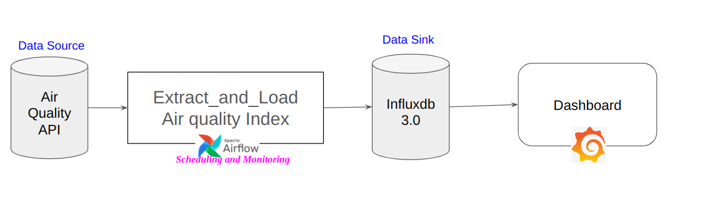

# A. Diagram of the pipeline
### This repository is just for ETL process. To run the entire process with Airflow, InfluxDB, and Grafana, please check: https://github.com/turguttaha/demo_datapipeline_airflow.git


# B. Installation of the project
## Clone repository and set env
### ! Check first whether you have already conda installed. If it is not, you need to install conda first.

```
git clone https://github.com/turguttaha/Demo_Data_Pipeline.git
# If you will use this repository with airflow just skip following steps and apply Step -> D. Creating docker image
conda create --name  demo_ddp python=3.9.19
conda activate demo_ddp
python -m pip install --upgrade pip
pip install -r requirements.txt
pre-commit install
```

## Create ".env" file in the root folder of project.
### You can get api key from https://docs.openaq.org/docs/getting-started
### tip: this file is used only for python environment. If you use docker and apache airflow then you need to create this file in the dags folder in the airflow_setup repository.
```
api_key=<api key of the Air quality API>
INFLUXDB_TOKEN=<your influxdb token>
INFLUXDB_ORG=<your influxdb organization name>
INFLUXDB_URL=http://localhost:8086
```

# C. Test datapipeline functions
After installation of the repo create a jupyter notebook in the main folder like exploration.ipynb (to run functions)

## Compute data pipline for a city
### Check the database after executing this function.

```
from utils.compute_measurements import compute

city_name = "AMSTERDAM"
await compute(city_name=city_name)
```

# D. Creating docker image
Apache airflow uses docker image of the this repository. So if you wanna use it with apache airflow you need to create a docker image.
Run below script in the terminal. You don't need to run image in terminal. Apache airflow will do this for you.

```
docker build -t airflow_ddp .
```

# E. Code Version Menagement
- Use bumpversion command to change the version before git commit and pushing new changes(0.0.0 major, minor, patch)
```
bumpversion patch --allow-dirty
```
